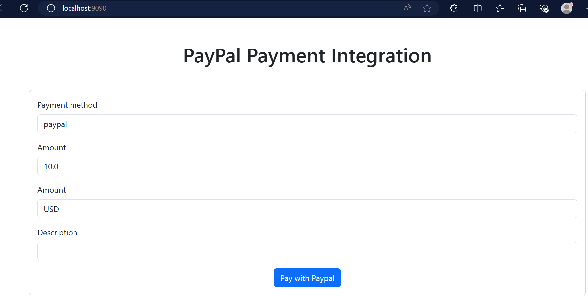
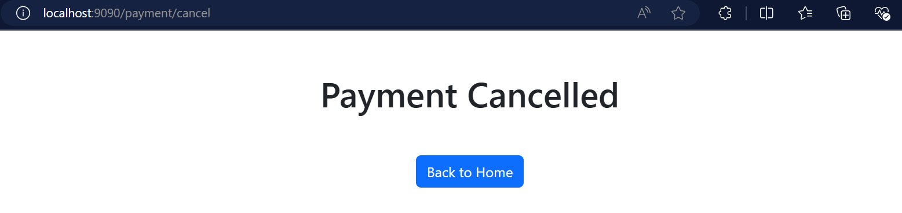

# PAYPAL INTEGRATION WITH SPRING BOOT

This is a demo project on how to integrate PayPal using spring boot.

## Get started

   - Prerequisites
      + Java 17
   - Clone the repository
   ````shell
   $ git clone https://github.com/Tountoun/paypal-integration-app.git
   ````
   - Open the project folder with your IDE of preference
   - Update the application.yml file
Before that, go to [PayPal developer](https://developer.paypal.com/home/) website and create an app.\
Copy and update the credentials.  
   ````yaml
   paypal:
     client-id: client-id
     client-secret: client-secret
   ````
   - Run the project

## Screenshots
   - Home Page
   
   - Error Page
   
   - Cancel Page
   
   - Success Page
   